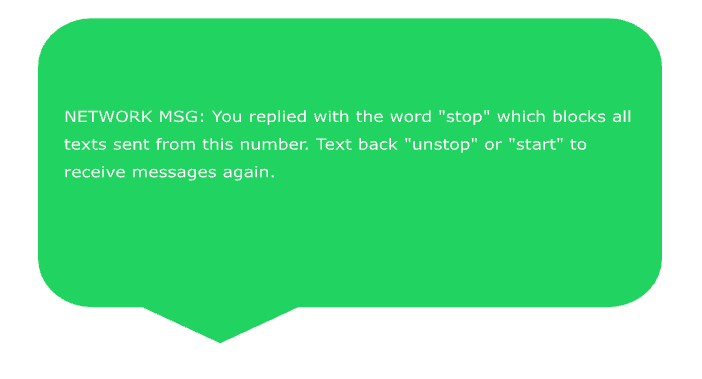

# Project Title: Offline GPT


## install
```
python3 -m venv offline-gpt-env 
source offline-gpt-env/bin/activate 
pip install -r requirements.txt 
```
## run
python /api/index.py

to run this project, you will need:
open ai API key
twilio API key

**Description:**
Offline GPT is an innovative AI project designed to bring the power of neural networks to offline environments. In today's interconnected world, where data privacy and security are paramount concerns, NeuralNetOffline offers a unique solution by enabling AI processing without the need for constant internet connectivity.

Using advanced machine learning algorithms and neural network architectures, Offline GPT allows users to perform complex AI tasks and analysis on their local devices, without relying on cloud-based services or external servers. This ensures data privacy, reduces latency, and enhances the overall user experience.

**Key Features:**
1. **Offline AI Processing:** Perform AI tasks and analysis without internet connectivity, ensuring data privacy and security.
2. **On-Device Learning:** Train and fine-tune neural networks directly on local devices, enabling personalized and adaptive AI models.
3. **Real-Time Inference:** Execute AI inference tasks in real-time, allowing for immediate insights and decision-making.
4. **Customizable Architectures:** Tailor neural network architectures to specific use cases and hardware constraints, optimizing performance and efficiency.
5. **Integration Flexibility:** Seamlessly integrate NeuralNetOffline into existing software applications and platforms, enabling AI capabilities in offline environments.
6. **Image Generation:** Generate images using neural networks directly on your device, empowering creative projects and visual applications.


Whether you're a developer looking to embed AI functionality into your offline applications or an organization seeking to leverage AI in secure environments, NeuralNetOffline provides the tools and infrastructure to unlock the full potential of offline artificial intelligence. Experience the future of AI, without compromising on privacy or performance, with Offline GPT.

[](https://vercel.com/new/clone?repository-url=https%3A%2F%2Fgithub.com%2Fvercel%2Fexamples%2Ftree%2Fmain%2Fpython%2Fflask3&demo-title=Flask%203%20%2B%20Vercel&demo-description=Use%20Flask%203%20on%20Vercel%20with%20Serverless%20Functions%20using%20the%20Python%20Runtime.&demo-url=https%3A%2F%2Fflask3-python-template.vercel.app%2F&demo-image=https://assets.vercel.com/image/upload/v1669994156/random/flask.png)

## Flask + Vercel

This example shows how to use Flask 3 on Vercel with Serverless Functions using the [Python Runtime](https://vercel.com/docs/concepts/functions/serverless-functions/runtimes/python).

## Demo

https://flask-python-template.vercel.app/

https://offline-gpt-coral.vercel.app/

## How it Works

This example uses the Web Server Gateway Interface (WSGI) with Flask to enable handling requests on Vercel with Serverless Functions.

## Running Locally

```bash
npm i -g vercel
vercel dev
```

Your Flask application is now available at `http://localhost:3000`.

## One-Click Deploy

Deploy the example using [Vercel](https://vercel.com?utm_source=github&utm_medium=readme&utm_campaign=vercel-examples):

[](https://vercel.com/new/clone?repository-url=https%3A%2F%2Fgithub.com%2Fvercel%2Fexamples%2Ftree%2Fmain%2Fpython%2Fflask3&demo-title=Flask%203%20%2B%20Vercel&demo-description=Use%20Flask%203%20on%20Vercel%20with%20Serverless%20Functions%20using%20the%20Python%20Runtime.&demo-url=https%3A%2F%2Fflask3-python-template.vercel.app%2F&demo-image=https://assets.vercel.com/image/upload/v1669994156/random/flask.png)


## Quick Start


- Start by sending a text message; you will then be presented with an array of options for using the service.
    - Response:   
  


- If you text 'Gpt', you can make a prompt via SMS and receive a text response.
  - Example
    - Prompt: 'Gpt How many lemons does a lemon tree produce a year?'
    - Response : 'The number of lemons produced by a lemon tree can vary depending on factors such as the age and health of the tree, the variety of lemon tree, the climate, and the care it receives. On average, a mature lemon tree can produce anywhere from 500 to 600 lemons per year. Some well-cared-for lemon trees have been known to produce even more fruit.'
    

 
    
- If you text 'Dalle', the service will generate an image based on keywords.
  - Example
    - Prompt: 'Dalle a robo bee on a futuristic flower'
    - Response:
      
    


- If you text 'Stop', the service will halt.
  - Example
    - Prompt: 'Stop' 
    - Response:
    
    


